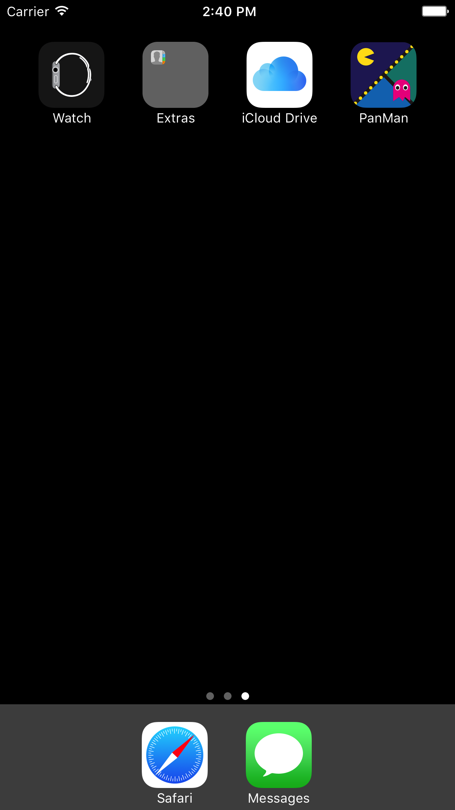
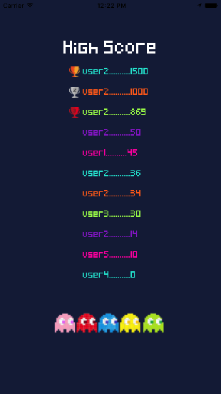

# Real Lyfe PacMan

## Overview

DevBootcamp final project by [Steven Aguilar](https://github.com/Steven2493), [Rakey Drammeh](https://github.com/rdrammeh), [Sofia Forsell](https://github.com/sforsell), [Sara Sulit](https://github.com/sarayapsulit) & [Steven Yuen](https://github.com/steveny91).

## About the app
A physical scavenger game built with React Native that utilizes geo location. Get some exercise while having fun!
This was our final project while attending DevBootcamp. We had 5 days to build our final project. Before starting this project we had no prior experience with React-Native, and through this project we have learned more about the life cycle of a component, dev-ops, the importance of proper git workflow and improved our abilities of reading the docs. Lastly, we learned a lot about user experience through visual design and technological architectural design. We are really proud of the end result of this project.

{:display="inline-block" margin-left="10px"}
{:display="inline-block" margin-left="10px"}

## Technologies
* [React Native](https://github.com/facebook/react-native)
* [Airbnb/React Native Maps](https://github.com/airbnb/react-native-maps)
* [React Navigation](https://github.com/react-community/react-navigation)
* [Google Directions API](https://developers.google.com/maps/documentation/directions/start)
* [Google Roads API](https://developers.google.com/maps/documentation/roads/intro)
* [Rails API](#)

## Deployment
* get your API keys from Google
* download xcode from Apple
* after cloning the repo, run `npm install` in the directory.
* put your API keys in their respective places
* `open ios/AwesomeProject.xcodeproj` takes a while to load.
* note that the cocoapods file for styling the map is too big for github so please refer to [some link](#) for styling.

## Control flow
When the game starts, an array of 50 random coordinates within the frame of the mapview is generated and sent to google roads *snap to road* and that's the 'candy'. 25 random points out of the 50 coordinates are sent to google directions and the result of that request determines the movement of the ghost. The ghosts directions request is sent once for each ghost. Proximity between the player and candies/ghosts are checked on a set interval. When the game ends you are taken to a results view where you can choose to play again or go to your personal stats.
